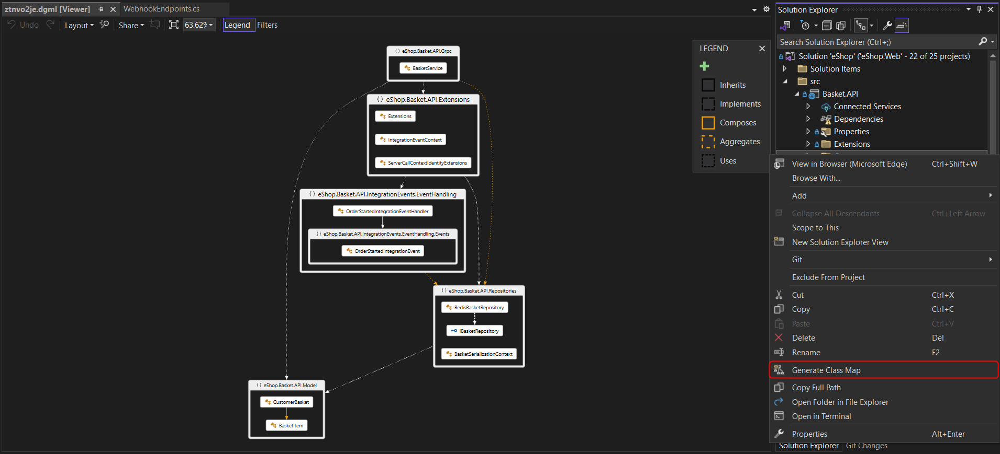

# Vsix-QuickClassMap

This Visual Studio extension shows relationships between classes in your C# project or individual folders or files. Multiple selection of folders or files is supported too.

The ouput is a DGML diagram. (You need DGML componentn to be installed in your Visual Studio.)

The extension uses heuristic to distinguish between 5 types of relations: Inheritance, Implementation, Composition, Aggregation and general Use.

