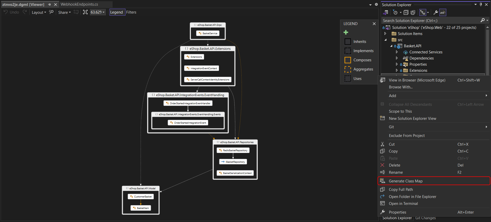

# Vsix-QuickClassMap

This Visual Studio extension shows relationships between classes in your C# project, as well as in
individual folders or files. It also supports selecting multiple folders or files.

Currently, the output is a DGML diagram.

## Requirements

- Visual Studio 2022, 2026
- DGML component installed (Visual Studio Installer → Individual components → Code tools → DGML editor)

## Relationship types

The extension uses heuristics to identify five types of relationships:

- Inheritance
- Implementation
- Composition
- Aggregation
- Uses

**Limitation:** To balance speed and accuracy, **Composition** and **Aggregation** relationships may not always be detected reliably and may be reported as **Uses** instead.

## Commands

### Generate Class Map

In Solution Explorer, select one or more files or folders, or a single project. Open the context menu and select **Generate Class Map**. The extension generates a DGML diagram showing relationships between classes in the selected items.

**Limitation:** Analysis currently works within one project at a time.

### Walk Up and Walk Down

- **Walk Down Class Map** follows relationships to discover the dependencies of the selected classes.
- **Walk Up Class Map** follows relationships in reverse to discover classes that depend on the selected classes.

In Solution Explorer, select one or more files or folders, or a single project. Open the context menu, choose the desired command, and select a traversal depth. Available depths are 1, 2, 3, 5, and 8 levels.

To limit map growth, the extension stops following `Uses` relationships after the first collaborator level.

